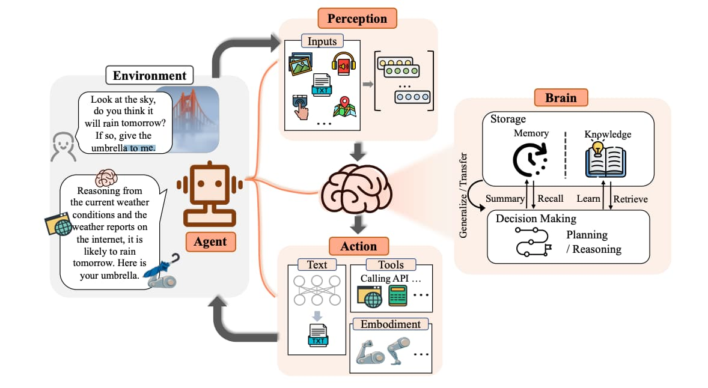
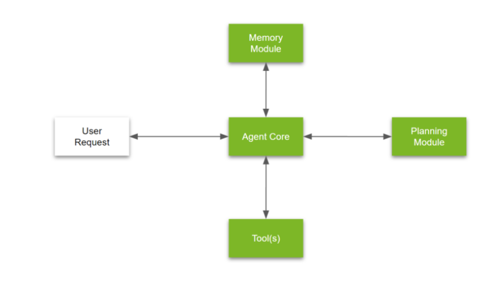

# LLM Agents

## Introduction to LLM Agents

Large Language Model (LLM) agents are smart program working with AI model trained on vast amounts of text data to understand and generate human-like language. 

They can engage in conversations, answer questions, and provide information on a wide range of topics. 

By leveraging their language processing capabilities, LLM agents can assist with tasks such as language translation, writing, programming, analysis and more.

Image Source: https://arxiv.org/pdf/2309.07864.pdf

The above image represents a potential theoretical structure of an LLM-based agent proposed by the paper “**[The Rise and Potential of Large Language Model Based Agents: A Survey](https://arxiv.org/pdf/2309.07864.pdf)**”

It comprises three integral components: the brain, perception, and action. 

- Functioning as the central controller, the **brain** module engages in fundamental tasks such as storing information, processing thoughts, and making decisions.
- Meanwhile, the **perception** module is responsible for interpreting and analyzing various forms of sensory input from the external environment.
- Subsequently, the **action** module executes tasks using appropriate tools and influences the surrounding context.

The above framework represents one approach to breaking down the design of an LLM agent into distinct, self-contained components. However, please note that this framework is just one of many possible configurations.

## LLM Agent Framework
Breaking down the agent into 3 key components: 
- brain, 
- perception, 
- action. 

In this section, we will explore a more widely used framework for structuring agent components. 

This framework comprises the following essential elements:

Image Source: [https://developer.nvidia.com/blog/introduction-to-llm-agents/](https://developer.nvidia.com/blog/introduction-to-llm-agents/)

1. **Agent Core:** The agent core functions as the central decision-making component within an AI agent. It oversees the core logic and behavioral patterns of the agent. 
2. **Memory Module:** Memory modules are essential components of AI agents, serving as repositories for storing internal logs and user interactions. These modules consist of two main types: 
    1. Short-term memory
    2. Long-term memory
        
3. **Tools:** Tools represent predefined executable workflows utilized by agents to execute tasks effectively. 

4. **Planning Module:** Complex problem-solving often requires well structured approaches.These techniques may involve task decomposition, breaking down complex tasks into smaller, manageable parts, and reflection or critique, engaging in thoughtful analysis to arrive at optimal solutions.

## Multi Agent System(MAS)
A Multi-Agent System (MAS) is a collection of autonomous agents that interact and cooperate to achieve common goals. 

Each agent is a self-contained program that perceives its environment, reasons about its actions, and takes decisions to achieve its objectives. 

In a MAS, agents communicate and negotiate with each other to coordinate their actions, share information, and adapt to changing situations.

## Build your own agent

We  will see three use-cases of building which will connect with LLM model and give the final report of task completion.

## 1. Text-to-SQL agents
Here is task is to make agent intearct with SQL tables and extract answers using plain text query and which is then converted into SQL by the agents.

We are using following framework:
- Autogen for agents
- spider for SQL 

## 2. Business Development agents

Here we have task is of identifying next product to be launched.This is a multi-agent system

- Market-Research analyst
- Technology expert
- Business Consultant

These agents performs the reserach and comes back with analysis report for product

We are using following framework:
- CrewAI

## 3. Tech-team agents
In this example we have 3 agents who does the  brainstorming for new feature development within an existing product.

Following are agents built in this:
- Product manager
- Developer
- Project Lead

We are using following framework:
- CrewAI

